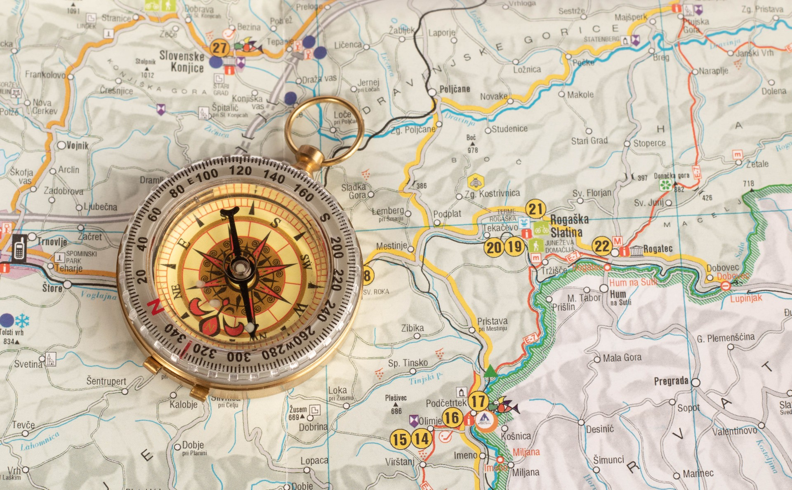

Durch verschiedene Aktivitäten stärkt das Projekt [OA Datenpraxis](https://oa-datenpraxis.de) den Umgang mit Daten im Kontext der Open-Access-Transformation. In einer Veranstaltungsreihe wird nun das Thema Open-Access-Reporting aus verschiedenen Perspektiven beleuchtet.

Open-Access-Reporting gewinnt zunehmend an Bedeutung: Open-Access-Policies sowie die Integration von Open Access in die Forschungsevaluation machen die Erstellung aussagekräftiger Berichte immer wichtiger. Allerdings sind viele Fragen zu klären - beispielsweise die Wahl der Datenquelle(n), die Zuordnung von Publikationen zu einer Einrichtung oder die Definition von Open-Access-Typen [@deinzer_open-access-reporting_2022].

In der Veranstaltungsreihe wollen wir uns einen Überblick verschaffen. Dafür betrachten wir zunächst, wie wissenschaftliche Einrichtungen Open-Access-Reporting in der Praxis umsetzen. Anschließend befassen wir uns mit Initiativen und Richtlinien, die einen Bezug zum Open-Access-Reporting haben und fragen uns - ist eine einrichtungsübergreifende Standardisierung sinnvoll und möglich?

### 27.03.2026, 12:30–14:00 Uhr - Webinar „Open-Access-Reporting in der Praxis"

In diesem Webinar möchten wir die Realität der Berichterstattung im Kontext der Open-Access-Transformation beleuchten. In kurzen Vorträgen berichten Juliane Mörsel von der Bibliothek des Karlsruher Instituts für Technologie und Dirk Pieper von der Universitätsbibliothek Bielefeld von der Reporting-Praxis an ihren Einrichtungen. In der anschließenden Q&A-Session haben Teilnehmende die Gelegenheit, sich zu Erfahrungen und Herausforderungen, die ihnen in der Praxis begegnen, auszutauschen.

Diese Veranstaltung richtet sich an Mitarbeitende in wissenschaftlichen Einrichtungen, die mit Monitoring und Berichterstattung im Kontext der Open-Access-Transformation betraut sind.

Zur [Anmeldung](https://hu-berlin.zoom.us/meeting/register/lzRSvMZGToupf-vp9L8Kdg#/registration)

------------------------------------------------------------------------

### 14.04.2026, 15:00–16:30 Uhr - Paneldiskussion „Open-Access-Reporting - Initiativen und Guidelines"

An dieser Paneldiskussion beteiligen sich Initiativen und Empfehlungen, die einen Bezug zum Open-Access-Reporting aufweisen. Die Veranstaltung kreist um die zentrale Frage, wie die Berichterstellung im Kontext der Open-Access-Transformation gestaltet werden kann und inwieweit eine einrichtungsübergreifende Standardisierung sinnvoll und möglich ist.

An der Paneldiskussion nehmen Expert\*innen teil, die sich aus verschiedenen Perspektiven mit dem Thema befasst haben: Evgeny Bobrov (Mitinitiator der [Open Science Monitoring Initiative](https://open-science-monitoring.org/about/initiative/)) Stefanie Haustein (Ko-Autorin der [Guidance List for the repOrting of Bibliometric AnaLyses (GLOBAL)](https://doi.org/10.1162/QSS.a.12)) Bernhard Mittermaier (Ko-Autor eines [Papiers](https://doi.org/10.48440/ALLIANZOA.047) der AG Wissenschaftliches Publikationssystem, Allianz der deutschen Wissenschaftsorganisationen) Fatma Rebeggiani (Redaktionsmitglied des [ersten deutschen Staatenberichts zur UNESCO-Empfehlung zu Open Science](https://www.unesco.de/dokumente-und-hintergruende/publikationen/detail/erster-deutscher-staatenbericht-zur-unesco-empfehlung-zu-open-science/#:~:text=Mit%20der%20UNESCO%20UNESCO%20UNESCO,Grundlage%20von%20Offener%20Wissenschaft%20geschaffen)) Nina Schönfelder (Mitarbeit am [Publikations- und Kostenmonitoring in Nordrhein-Westfalen (pkm_nrw)](https://pkm-nrw.ub.uni-bielefeld.de))

Diese Veranstaltung richtet sich an Mitarbeitende in wissenschaftlichen Einrichtungen, die mit Monitoring und Berichterstattung im Kontext der Open-Access-Transformation betraut sind.

Zur [Anmeldung](https://hu-berlin.zoom.us/meeting/register/FQ0J688cRX2jkTW_S3lk0A#/registration)

------------------------------------------------------------------------

Ein drittes Webinar mit Einblicken in die Erhebungspraxis befindet sich in Vorbereitung. Rückfragen können Sie gerne jederzeit an das Projektteam von OA Datenpraxis richten: info.oa-datenpraxis\@listserv.dfn.de

Weitere Informationen über die Forschungsgruppe Information Management an der Humboldt-Universität zu Berlin, einem der Partner im Projekt, finden sich auf der [offiziellen Website der Gruppe](http://hu.berlin/infomgnt). Informationen zum Helmholtz Open Science Office finden sich auf [dieser Webseite](https://os.helmholtz.de).

Dieser Text – mit Ausnahme von Zitaten und anderweitig gekennzeichneten Abschnitten – steht unter der [CC BY 4.0 DEED](https://creativecommons.org/licenses/by/4.0/deed.de).

---
nocite: |
  @*
---
