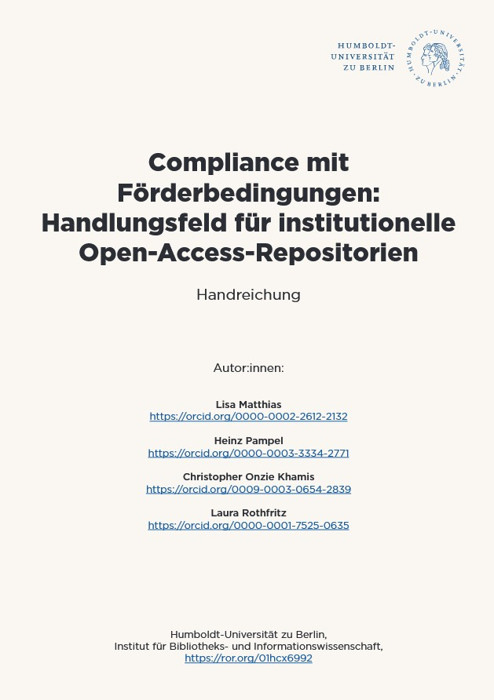

We are pleased to announce the publication of our sixth guide from the BMFTR-funded (Federal Ministry for Research, Technology and Space) project “Professionalisierung der Open-Access-Repositorien-Infrastruktur in Deutschland (Pro OAR DE)”: “Compliance mit Förderbedingungen: Handlungsfeld für institutionelle Open-Access-Repositorien” (available in German only).

Matthias, L., Pampel, H., Khamis, C. O., & Rothfritz, L. (2025). *Compliance mit Förderbedingungen: Handlungsfeld für institutionelle Open-Access-Repositorien. Pro OAR DE Handreichung.* Zenodo. <https://doi.org/10.5281/zenodo.18085346>

{fig-align="center"}

This guide documents the outcomes of our networking forum “Institutionelle Repositorien und Compliance mit Förderbedingungen” (Institutional Repositories and Compliance with Funding Requirements) held on July 7, 2025, with nearly 100 Open Access professionals from across Germany. Drawing on the collaborative work of participants, the guide offers concrete, practice-oriented recommendations for strengthening compliance with funder requirements through institutional Open Access repositories.

Experts Michael Geuenich (Deutsche Forschungsgemeinschaft) and Anna Pelagotti (European Research Council Executive Agency) outlined current German national and European funding requirements and discussed their implications for repository infrastructures. Building on these insights, participants collaborated in thematic groups to exchange institutional experiences and develop practical solutions to shared challenges. Presentation slides from the forum are available [online](https://zenodo.org/records/15831828).

The guide synthesizes these collective insights into practical recommendations organized around five central areas for institutional repository management in the context of compliance with funder requirements.

## Requirements

Participants identified the dynamic development of compliance criteria as a central challenge. Funder requirements evolve continuously and therefore demand ongoing monitoring. Clear assignment of responsibilities within institutions was highlighted as essential, particularly in complex organizational environments where libraries, IT services, research support units, and administrative departments all play a role.

Communication emerged as another key issue. Ensuring that compliance requirements are correctly understood and implemented depends on effective exchange between researchers and infrastructure providers, but equally between content experts and technical staff. Limited financial and personnel resources further intensify the need for prioritization and transparent workflows. Participants also emphasized the value of institutional publication policies as binding reference points, provided their concrete benefits for researchers are clearly communicated.

On the infrastructure side, participants suggested establishing repository content curation as a dedicated service. This could be implemented, for example, through specialized roles such as data stewards. In addition, the introduction of automated checks for compliance requirements was considered a particularly effective approach. As initial steps, participants recommended centrally collecting best practices and bringing in advocates, such as data champions, to share expertise across the institution.

## Researcher Consultation

Advising researchers on compliance requirements presents multiple challenges. Participants highlighted the difficulty of determining the compliance status of their own repositories in the absence of universally accepted standards. In addition, requirements vary considerably between funders and projects, adding another layer of complexity.

Reaching researchers at the right moment remains a persistent obstacle. General information events are often poorly attended, and researchers may engage only selectively with available support services. Recommending suitable repositories brings its own difficulties, as existing certificates and quality labels offer only partial guidance and tend to be limited to specific content types.

In response, participants recommended using established orientation tools such as the [DFG whitelist](https://www.dfg.de/resource/blob/176038/23fa3addedec7aacc60a6f9f6e314c16/dfg-whitelist-data.pdf) for subject repositories and the [TRUST](https://www.nature.com/articles/s41597-020-0486-7) principles for digital repositories. For day-to-day advisory work, strategic questions can help structure consultations effectively, in particular, identifying the precise level at which funder requirements are defined, such as whether the level of the funder, the program, or the individual call. This approach can help uncover information that is not publicly documented.

## Technical Solutions

At the technical level, compliance and interoperability present a set of challenges. European funding programs often impose stricter requirements than German national schemes, particularly regarding metadata standards, persistent identifiers, and repository trustworthiness.

Practical challenges include implementing specific metadata fields, ensuring Persistent Identifier (PID) assignment, enabling indexing in relevant discovery services, managing large data uploads, and establishing robust rights and roles management. Cost-related information may be recorded in different systems, inside or outside the repository, further increasing complexity.

Participants recommended several approaches to navigate these challenges. Certifications can serve as a useful step toward compliance, while narrowing repository use cases helps ensure feasibility. Market analyses of available software solutions, including realistic assessments of costs and personnel resources, were seen as essential groundwork. Cooperation with partner institutions emerged as a particularly promising strategy, offering opportunities to improve interoperability and distribute development efforts more sustainably.

## Diversity of Publication Formats

The growing diversity of scholarly outputs significantly complicates compliance with funder requirements. Participants pointed to conceptual ambiguities surrounding the definition of repositories and publications, particularly in relation to research data and non-textual outputs. Different funders apply different standards, making general harmonization difficult.

Research data as a publication type introduces its own set of demands. Metadata requirements increase, machine readability becomes a factor, and linking publications with associated datasets poses real practical difficulties, particularly when Persistent Identifiers are not yet available at the time of initial publication. Further complexity arises from formats such as posters, workshop reports, and Open Educational Resources.

Responsibilities for repository operation and compliance support are often poorly defined, especially where text publications and research data fall under different organizational units. Participants emphasized the importance of transparent coordination structures and regular communication. Distributed advisory models with discipline-specific working groups were recommended, alongside the strategic use of external expertise such as Nationale Forschungsdateninfrastruktur (NFDI) helpdesks.

## Additional Challenges

Beyond the areas already mentioned, participants raised additional challenges. European requirements for depositing research data in “trusted repositories” remain difficult to interpret in practice. The assignment of new Digital Object Identifiers (DOIs) during secondary publication can confuse researchers and make it harder to identify project-related outputs, particularly in the context of EU-funded research.

Insufficient incentives for researchers to provide complete funding information were also highlighted. Where funding acknowledgements are inconsistent or missing, both compliance and reporting suffer. Participants therefore stressed the importance of controlled project lists and standardized interfaces that make it easy for researchers to reference their funded projects accurately.

Visibility matters too. Continuous communication about available services is essential for promoting repository use and driving uptake, and a coherent outreach strategy can make a significant difference. Participants also articulated expectations toward funders and policy actors — above all, the provision of standardized project lists and APIs to support automated workflows and reduce administrative burden on institutions.

This guide provides a foundation for continued professional exchange. Repository operators, libraries, and institutional decision-makers will find valuable insights for establishing effective workflows within their institutions.

We extend our sincere thanks to all forum participants who contributed their expertise and experience to this collaborative effort. We welcome your feedback and look forward to continuing this important dialogue as we collectively strengthen the Open Access repository landscape.

For more information about Pro OAR DE and our upcoming activities, please visit our [website](https://www.ibi.hu-berlin.de/de/forschung/infomanagement/projekte/pro-oar-de). This text – excluding quotes and otherwise labeled sections – is licensed under the CC BY 4.0 DEED.

---
nocite: |
  @*
---
