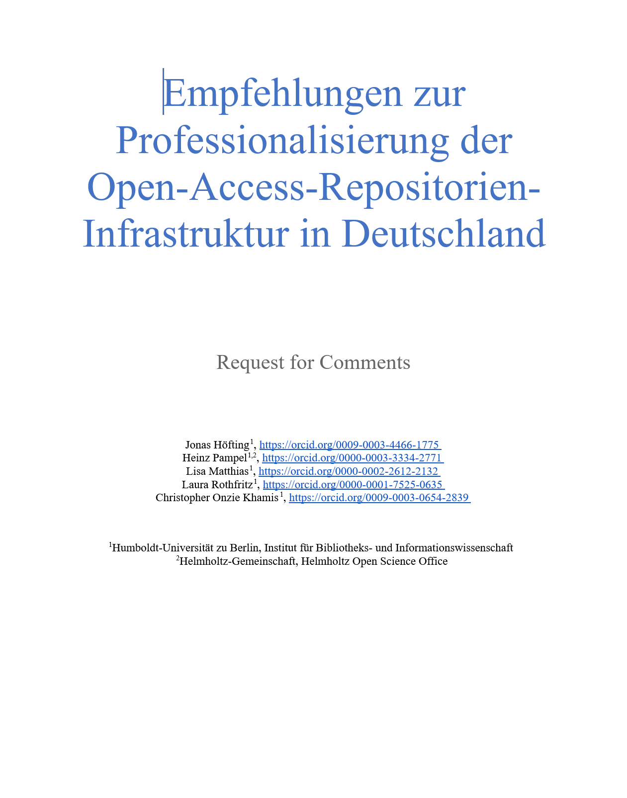

Institutionelle Repositorien (IRs) sind heute ein zentraler Bestandteil der Informationsinfrastruktur vieler Forschungseinrichtungen. Mit der wachsenden strategischen Bedeutung von Öffnungsprozessen in der Wissenschaft, die unter dem Begriff Open Science diskutiert werden, steigen auch die Anforderungen an den Betrieb von IRs. Dabei wirken sich wandelnde Anforderungen aus wissenschaftlichen Communities, technologische Entwicklungen und förderpolitische Entwicklungen auf ihren Betrieb aus.

Dank der Förderung des Bundesministeriums für Forschung, Technologie und Raumfahrt (BMFTR) haben wir uns im Projekt [Pro OAR DE](https://infomgnt.org/projects/pro-oar-de/) intensiv mit dem Stand und der Perspektive der IRs in Deutschland beschäftigt.

## Empirische Grundlage

Den Ausgangspunkt bildete ein Systematic Literature Review, das die in der internationalen bibliotheks- und informationswissenschaftlichen Literatur diskutierten Herausforderungen für den Betrieb von IRs untersuchte [@rothfritz_current_2026]. Ergänzend dazu wurden 15 qualitative Expert:inneninterviews mit IR-Manager:innen deutscher wissenschaftlicher Bibliotheken geführt [@wrzesinski_challenges_2026]. Aufbauend auf diesen Ergebnissen organisierte das Projektteam anschließend [sieben virtuelle Vernetzungsforen](https://zenodo.org/communities/infomgnt/records?q=&f=publication_date%3A2025..2025&f=resource_type%3Apublication%2Binner%3Apublication-report&l=list&p=1&s=10&sort=newest) zu zentralen Themenfeldern. Diese kombinierten Impulsvorträge mit Diskussionen in Kleingruppen; die Ergebnisse wurden dokumentiert und als praxisorientierte Handreichungen veröffentlicht.

## Zehn Empfehlungen

Die Ergebnisse dieser drei Projektteile wurden zusammengeführt, um Handlungsfelder und Lösungsvorschläge zu extrahieren, und um weitere Aspekte ergänzt, die im Laufe der Projektlaufzeit die Fachdiskussion prägten. Das Resultat sind Empfehlungen zur Professionalisierung der Open-Access-Repositorien-Infrastruktur in Deutschland, die zehn Handlungsfelder adressieren:

1.  **Institutionelle Governance und Verantwortung stärken** – IRs sollten verbindlich in institutionellen Strategien verankert und von der Leitungsebene ausdrücklich als strategische Infrastruktur anerkannt werden.

2.  **Finanzielle und personelle Ressourcen nachhaltig sichern** – Gefordert werden langfristige Finanzierungsmodelle sowie gezielte Professionalisierung des Personals an den Schnittstellen von Bibliothek, IT, Verwaltung und Wissenschaft.

3.  **Monitoring etablieren und systematisch nutzen** – Einrichtungen sollten strategisch entscheiden, welche Rolle IRs für Publikations-, Kosten- und Compliance-Monitoring spielen sollen und wie die gewonnenen Daten in Entscheidungsprozesse einfließen.

4.  **Künstlicher Intelligenz strategisch begegnen** – Empfohlen werden ein strategisches Bot-Management entlang der COAR-Initiative „Dealing with Bots" [@shearer_open_2025] sowie die verantwortungsvolle Nutzung KI-gestützter Werkzeuge im IR-Betrieb.

5.  **Rechtliche Rahmenbedingungen berücksichtigen** – Empfohlen werden integrierte Beratungsangebote zu Lizenzierung und Zweitveröffentlichung sowie standardisierte Verfahren zur Rechteprüfung.

6.  **Kommunikation und Vernetzung ausbauen** – Notwendig sind klare Organisations- und Kommunikationsstrukturen, zielgruppenspezifische Angebote für Wissenschaftler:innen sowie stärkere nationale und internationale Vernetzung.

7.  **Interoperable und nachhaltige Systeme etablieren** – Empfohlen wird die konsequente Nutzung etablierter Standards, persistenter Identifikatoren und interoperabler Open-Source-Lösungen.

8.  **Vielfalt wissenschaftlicher Outputs anerkennen und unterstützen** – Unterschiedliche Publikationsformate sollten technisch und organisatorisch besser berücksichtigt sowie die Vernetzung mit Forschungsdaten strategisch gestaltet werden.

9.  **Metadatenqualität erhöhen** – Empfohlen werden professionalisierte Kurationsworkflows mit hohem Automatisierungsgrad sowie benutzerfreundliche Eingabesysteme und Interfaces.

10. **Digitale Langzeitverfügbarkeit sicherstellen** – Gefordert werden institutionelle Konzepte zur Langzeitverfügbarkeit sowie Kooperationen mit spezialisierten Einrichtungen.

## Jetzt mitgestalten

Bevor diese Empfehlungen final veröffentlicht werden, durchlaufen sie einen Request-for-Comments-Prozess (RfC). Ziel dieses Verfahrens ist die Qualitätssicherung und die Entwicklung einer möglichst breiten Konsensbasis innerhalb der Open-Access-Community. Das Projektteam versteht den RfC ausdrücklich als offene Einladung zur Mitgestaltung: Rückmeldungen können von kleineren Formulierungsvorschlägen bis hin zu grundlegender Kritik reichen. Besonders gefragt ist, welche Themen aus Sicht der Community noch fehlen oder welche Vorschläge geändert werden sollten. Im Anschluss an die Kommentierungsphase wird das Projektteam die eingegangenen Rückmeldungen einarbeiten und schließlich eine finale Version der Empfehlungen veröffentlichen.

Für die Beteiligung stehen zwei Wege offen: Das [Google-Dokument](https://docs.google.com/document/d/1c6CvGNJ4pZ_Dlawz4JokZfOp_rVy3V5FHZ6dyJGGud0/edit?usp=sharing) ermöglicht eine öffentliche Kommentierung direkt im Dokument. Wer anonym kommentieren oder keinen Google-Account nutzen möchte, kann alternativ die [ODT-Version](https://hu.berlin/79486) herunterladen, lokal kommentieren und per E-Mail an [jonas.hoefting\@hu-berlin.de](mailto:jonas.hoefting@hu-berlin.de) einsenden.

In beiden Fällen ist die Kommentierung bis zum 14.06.2026 möglich.

Das Projektteam bedankt sich herzlich bei allen Beteiligten – den Interviewpartner:innen, den Vortragenden und Teilnehmenden der Vernetzungsforen sowie allen Personen, die sich am RfC beteiligen.

Das Projekt Pro OAR DE wird vom Bundesministerium für Forschung, Technologie und Raumfahrt (BMFTR) unter dem Förderkennzeichen 16KOA001 gefördert.

------------------------------------------------------------------------

Weitere Informationen zur Forschungsgruppe finden sich auf unserer [offiziellen Website](http://hu.berlin/infomgnt).

Dieser Text – mit Ausnahme von Zitaten und anderweitig gekennzeichneten Teilen – steht unter der [CC BY 4.0 DEED](https://creativecommons.org/licenses/by/4.0/deed.de).

---
nocite: |
  @*
---
