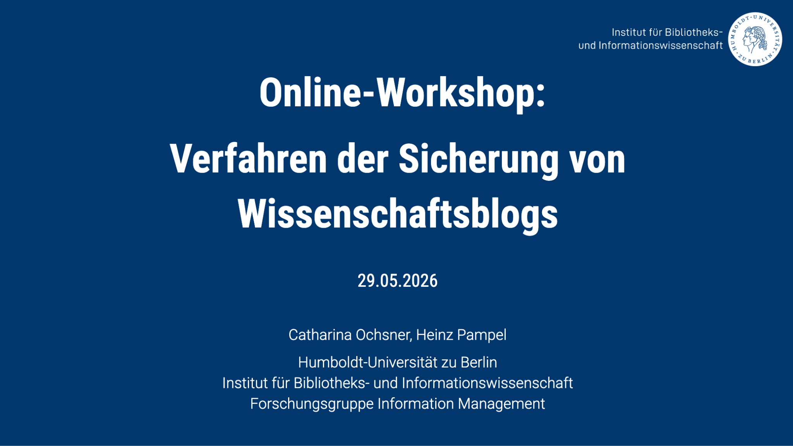

As part of the [Infra Wiss Blogs](https://infrawissblogs.org/) project, funded by the [German Research Foundation (DFG)](https://www.dfg.de/), on May 29 2026 we hosted an [online workshop](https://www.ibi.hu-berlin.de/de/forschung/infomanagement/events/online-workshop-verfahren-der-sicherung-von-wissenschaftsblogs) on the digital preservation and accessibility of blogs with the goal of bringing together experts from various information infrastructure institutions to present existing procedures and discuss them collaboratively. The workshop was enriched by three contributions by experts from infrastructure facilities that already integrate blogs into their collections.

{fig-align="center"}

Ivo Vogel and Nihal Ariz from the [Specialized Information Service for International and Interdisciplinary Legal Research - FID intRecht](https://intrecht.de/en/) presented how scholarly blogs are integrated into the [intRechtDok](https://intrechtdok.de/content/index.xml) repository. Michael Czolkoß-Hettwer from the [Specialized Information Service Political Science (Pollux)](https://pollux-fid.de/) talked about Blog preservation efforts at Pollux while Jochen Walter from the [German Literature Archive (Deutsches Literaturarchiv, DLA](https://www.dla-marbach.de/en/) provided insights into the archiving of digital literature and blogs. All presentations were published:

Czolkoß-Hettwer, D. M. (2026, May 29). Wissenschaftsblogs & Pollux: Indexierungsverfahren und Unterstützung von Blogs bei der Langzeitverfügbarkeit. Zenodo. <https://doi.org/10.5281/zenodo.20491760>

Ochsner, C., & Pampel, H. (2026, May 29). Online-Workshop: Verfahren der Sicherung von Wissenschaftsblogs. Zenodo. <https://doi.org/10.5281/zenodo.20492209>

Vogel, I., Ariz, N., (2026). Von flüchtigen Blogposts zu zitierfähigen Forschungsressourcen: Wissenschaftsblogs in intRechtDok. <https://doi.org/10.17176/20260529-120200-0>

Walter, J. (2026, May 29). Verfahren der Sicherung von Blogs: Praxis am DLA Marbach. Zenodo. <https://doi.org/10.5281/zenodo.20526739>

## Discussion

Together with more than 30 participants from specialized information services, libraries, archives, and research infrastructure organizations, we discussed practices of integrating blogs into digital research and information infrastructures. The discussion revealed that many institutions face similar challenges. A key topic was the question of how discussions and cross-references between blog posts can be documented over the long term. While individual replies or follow-up posts can be archived, it became clear that it is technically and organizationally difficult to capture the full history of discussions. Furthermore, participants discussed the question of which blogs should be considered scholarly blogs. Criteria such as academic affiliations, editorial quality control, and editorial boards were discussed. At the same time, it became clear that the diversity of scholarly blog formats makes it difficult to draw clear distinctions. Several participants emphasized the growing relevance of blogs. They noted that these are no longer merely communication tools, but are increasingly evolving into independent research resources and subjects of research in the history of science.

## Conclusion

Participants agreed that the long-term preservation of scholarly blogs is much more than a technical task. It requires the interplay of archiving, metadata standards, persistent identifiers, organizational processes, and collaboration between blog operators and infrastructure providers. At the same time, it became clear that viable solutions already exist today. Whether through repositories, aggregators, or archiving initiatives, scholarly blogs are increasingly recognized as part of the academic publishing landscape. Their long-term preservation is thus not only a matter of availability but also of safeguarding academic communication and the scholarly record.

Further information about the research group can be found on our [official website](http://hu.berlin/infomgnt).

This text – excluding quotes and otherwise labelled parts – is licensed under the [CC BY 4.0 DEED](https://creativecommons.org/licenses/by/4.0/deed.de).
