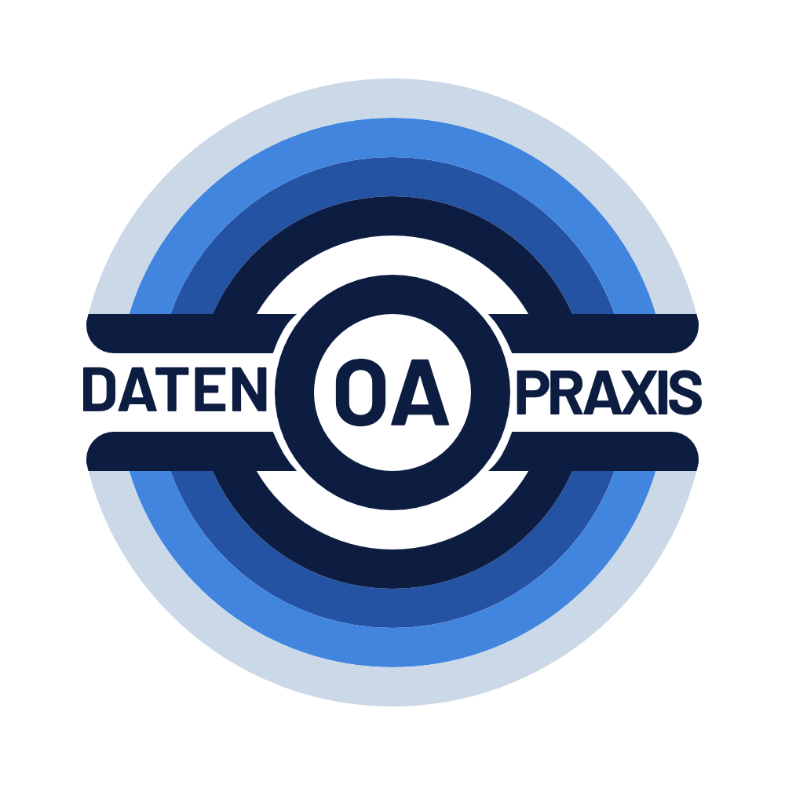

Das DFG-Projekt [OA Datenpraxis](https://oa-datenpraxis.de) unterstützt durch verschiedene Initiativen den Umgang mit Daten im Kontext der Open-Access-Transformation. In zwei praxisorientierten Veranstaltungen haben wir uns kürzlich mit der Erfassung des Publikationsaufkommens einer Einrichtung mithilfe der offenen Datenquelle [OpenAlex](https://openalex.org/about) beschäftigt.

{fig-align="center"}

Am 20.05.2026 haben wir bei der 114. BiblioCon in Berlin ein [Hands-on Lab](https://oa-datenpraxis.de/events/bibliocon26_20260520.html) angeboten. Bei der Veranstaltung “How To: Das Publikationsaufkommen Ihrer Einrichtung mit einer offenen Datenquelle erfassen” haben wir mit etwa 30 Teilnehmenden erarbeitet, wie sie mit Hilfe eines R-Notebooks Publikationsdaten ihrer Einrichtung anhand der ROR-ID über die OpenAlex API abfragen können. Danach haben wir die abgefragten Datensätze exploriert und für die weitere Auswertung vorbereitet; als Beispiel für die Datenbereinigung haben wir einen Ansatz zur Disambiguierung der Namensansetzungen von Verlagen durchgespielt. Aufgrund des großen Interesses haben wir das Format am 01.07.2026 mit einer ähnlichen Teilnehmendenzahl in einem Webinar wiederholt.

Beide Veranstaltungen waren in ihrem Aufbau angelehnt an das Format und die *teaching philosophy* von [The Carpentries](https://carpentries.org/). The Carpentries ist eine Initiative mit globaler Community, die Workshops zum Erlernen von grundlegenden Programmier- und Data-Science-Kenntnissen entwickelt und unterrichtet. Die Workshops basieren auf einem praxisorientierten Ansatz („Code with me“) und es wird besonderer Wert auf eine inklusive und unterstützende (Lern-)Kultur gelegt.

Beide Veranstaltungen von OA Datenpraxis folgten ebenfalls diesen Prinzipien und setzten keine Programmierkenntnisse voraus. Dadurch sollten insbesondere auch Personen zur Teilnahme ermutigt werden, die in ihrer bisherigen Berufspraxis noch wenig Berührungspunkte mit Datenanalysen gesammelt hatten. Während der Veranstaltungen wurden die Teilnehmenden ebenfalls ermutigt, sich aktiv zu beteiligen sowie Fragen zu stellen. Besonders interessiert waren die Teilnehmenden an der Präzisierung der Treffermenge, z. B. durch Boolesche Operatoren oder die Einschränkung auf Corresponding Authors, sowie die Ermittlung des Publikationsaufkommens bestimmter Autor:innen.

Die bei den Veranstaltungen genutzten Materialien wurden auf [GitHub](https://github.com/oa-datenpraxis/materials/tree/main/BiblioCon26) veröffentlicht. Dort ist unter anderem ein Musternotebook abgelegt, das neben Codeblöcken auch Erläuterungen zum Vorgehen enthält. Mit diesen Materialien können alle Interessierten die Inhalte der Veranstaltungen eigenständig nachvollziehen.

Ergänzend weisen wir gerne noch auf interaktive Notebooks hin, die wir im Rahmen des Projekts erstellt haben. Die Notebooks sind auf der OA Datenpraxis Projektwebseite veröffentlicht und können direkt im Browser ausgeführt werden – die Installation von Software ist darum nicht erforderlich.

-   [Open Access Cost Monitoring with OpenAPC](https://oa-datenpraxis.de/OpenAPC.html)

-   [Open Access Monitoring](https://oa-datenpraxis.de/OpenAlex.html)

-   [Affiliation search using ROR IDs](https://oa-datenpraxis.de/ROR.html)

------------------------------------------------------------------------

Weitere Informationen zur Forschungsgruppe finden sich auf unserer [offiziellen Website](http://hu.berlin/infomgnt).

Dieser Text – mit Ausnahme von Zitaten und anderweitig gekennzeichneten Teilen – steht unter der [CC BY 4.0 DEED](https://creativecommons.org/licenses/by/4.0/deed.de).
