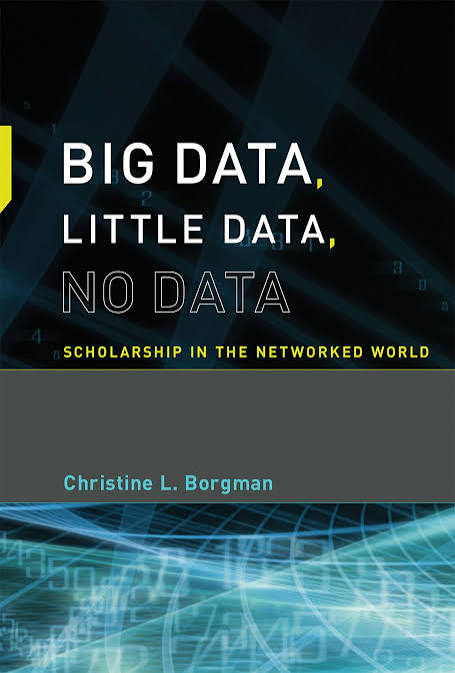

### Introduction

While preparing for my bachelor’s thesis, I recently took the time to read [Christine L. Borgman’s](https://orcid.org/0000-0002-9344-1029) book titled *"Big Data, Little Data, No Data: Scholarship in the Networked World"* [@borgman_big_2015], which was published in 2015 by the MIT Press in Cambridge, Massachusetts, and features 383 pages detailing the roles research data plays for different stakeholders in an ever-changing scholarly environment. I bought the book for 36€ because I prefer reading physical copies, but I also had the option to get free online access through my institution.

::: {style="text-align:center;"}

:::

The book was recommended to me as a good starting point for getting into the academic field of research data management by one of my colleagues. My main goal was to gain an overview of challenges in the field and maybe even find one that sparks my interest and that I could see myself writing my thesis about.

First, I’d like to start with a little background information about myself. I am currently in the seventh semester of pursuing my bachelor’s degree in Library and Information Science at the Humboldt-Universität zu Berlin. While my major is in LIS, I also minor in Classical Archeology and work as a student assistant at the research group Information Management. Prior to studying LIS I studied physics for five semesters.

In this blog post, my goal is to provide a general overview of the book and its author, as well as reflect upon it and state my personal opinion on it. I will be discussing who I would recommend this book to and end with a quick note on my reading experience as a student, how I went about writing this blog post and provide additional resources that helped me get started. Let me know if you are interested in a more in-depth view of the writing process of this blog post!

### About the Author

[Christine L. Borgman](https://orcid.org/0000-0002-9344-1029) is a distinguished Research Professor and Presidential Chair Emerita in Information Studies at the University of California, Los Angeles and is known for her many contributions to Computer Science, Data Science, Digital Humanities and more. Her current focus of research includes knowledge infrastructures, scientific data practices and open science. In her three award-winning books she discusses different aspects of scholarship and its infrastructure requirements in a modern age where information exchange is becoming more and more rapid.

### Premise

As stated in the book, its goal is to provoke and deepen the conversation about data practices among different stakeholders in knowledge infrastructures and assess the concept of 'data' from social, technical and policy perspectives. It builds on earlier works of the author on scholarship in the digital age. Borgman formulates six distinct provocations to initiate discussions of reproducibility, sharing data, treating data as distinct from publications, dissemination of data, evolving knowledge infrastructures and long-term investments in infrastructure, respectively.

### Structure

The book is split into three parts with multiple chapters. The provocations of the first chapter are followed by three chapters focusing on the definitions of data and data scholarship and are concluded by a description of the diversity of data. These chapters, along with the provocations, build the foundation for the second part of the book, which looks at case studies from the Sciences, Social Sciences and Humanities. Each chapter starts with a broad outline of the history of the field and its infrastructures and is followed by a description of a specific project within that field. These examples show how the infrastructure and data practices in that discipline interact with one another. Every chapter covers two different fields and their respective case studies. The third part highlights difficulties that emerge from engaging with research data. Three chapters discuss releasing, sharing and reusing data; credit, attribution and discovery of data; as well as what data to keep and why. The book concludes with a complete bibliography and an index.

### Personal Opinion

I think the book offers a great, accessible entry into the field of research data management. It gives a broad overview of challenges and discussions of the field that still remain relevant to this day and requires minimal prior knowledge. The insights into the different disciplines with their stakeholders and knowledge infrastructures were especially helpful in improving my understanding of the complex research data ecosystem. The structure of the book also makes it easy to follow the discussion and creates a streamlined reading experience. It also facilitates comparison between the fields outlined in the second part.

From my perspective as a minor in Classical Archeology, I would have liked the humanities case studies to go into more practical detail, for example on how excavation data, photographs or 3D models are documented and reused in everyday research and what role the interdisciplinary character of the discipline plays in handling research data.Compared with the detailed account of data practices in the sciences, this part felt somewhat less developed to me.

Still, I think that the author provides people interested in or working in infrastructures with a good framework of aspects to consider when familiarizing oneself with a discipline from a data management standpoint. Although I lack the experience to determine whether the author succeeded in her stated goal regarding the current discussion about data practices, the book certainly succeeded in diversifying my own view on research data. Especially with regard to different stakeholders and how the cultural aspects of various scientific disciplines shape how data is treated, the book was very helpful in providing me with a more detailed view of all the different factors that shape and influence data practices to this day. In conclusion, this book gave me a lot to think about and sparked motivation to further explore knowledge infrastructures and research data management.

### A Student’s Perspective on Reading the Book and Writing This Blog Post

#### Reading the Book

While reading the book, I gained a lot of new ideas for possible research topics, and the bibliography helped me find additional literature to pursue my interests. I would recommend this book to any student who is interested in the topic of research data management but has no idea where to start. While the writing style can sometimes be a bit convoluted and the book was published eleven years ago at this point, it motivated me to start thinking about my own future in the discipline.

#### Writing This Review

As this is the first monograph I have read in this field, I thought writing this review would be a great opportunity for me to not only describe the book, but also practice my writing skills and reflect on the writing process. Although the task to write my first own scholarly output was daunting at first, I found some great resources that helped me get started with writing this blog post. These are some resources I found useful:

-   For Structuring:

    -   Belcher, W. L. (2015). Writing the Academic Book Review. Los Angeles, CA: UCLA Chicano Studies Research Center. Retrieved July 8, 2026, from <https://www.wendybelcher.com/writing-advice/how-to-write-book-review/>

    -   Strategic Research Area Organisational Sociology, & Thomas, U. (2021). Guide to Writing Book Reviews in Academic Journals. University Potsdam <https://www.uni-potsdam.de/fileadmin/projects/hi-militaergeschichte/materialien/20210107_Guide_to_Writing_Book_Reviews_in_Academic_Journals.pdf>

-   As a Reference:

    -   Clemens, A. (n.d.). Book Review: Science Research Writing by Hilary Glasman-Deal. Dr. Anna Clemens. Retrieved July 8, 2026,from <https://annaclemens.com/blog/book-review-science-research-writing-hilary-glasman-deal/>

------------------------------------------------------------------------

Above all I, want to thank [Dorothea Strecker](https://infomgnt.org/members/Dorothea_Strecker/), who was always available for my questions and, along with [Catharina Ochsner](https://infomgnt.org/members/Catharina_Ochsner/) and [Heinz Pampel](https://infomgnt.org/members/Heinz_Pampel/), was a great help in giving me feedback and guiding me through the whole process of writing this blog post.

Also: if you are a student and have doubts about writing your first scholarly output, I strongly encourage you to try in the form of a blog post! Choosing this format can create a low-stress environment that is not as restrictive of your writing style as a journal article would be. Writing a blog post can help you gain practical experience with writing and let you explore topics you are interested in!

------------------------------------------------------------------------

Further information about the research group can be found on our [official website](http://hu.berlin/infomgnt).

This text – excluding quotes and otherwise labeled parts – is licensed under the [CC BY 4.0 DEED](https://creativecommons.org/licenses/by/4.0/deed.de). The cover design is © The MIT Press and is not covered by this post's CC BY 4.0 license.

---
nocite: |
  @*
---
